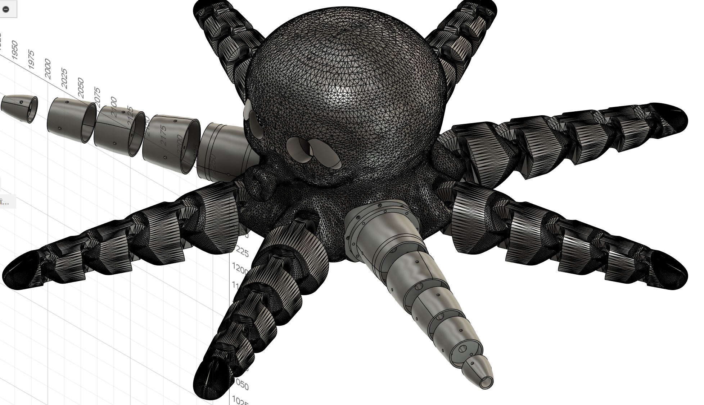
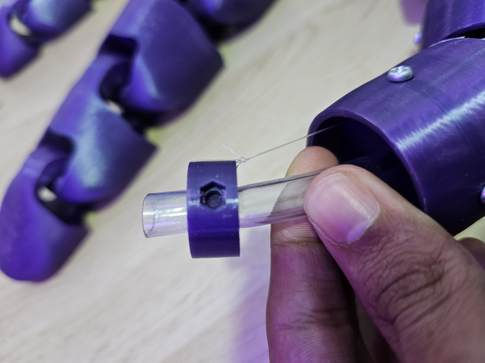
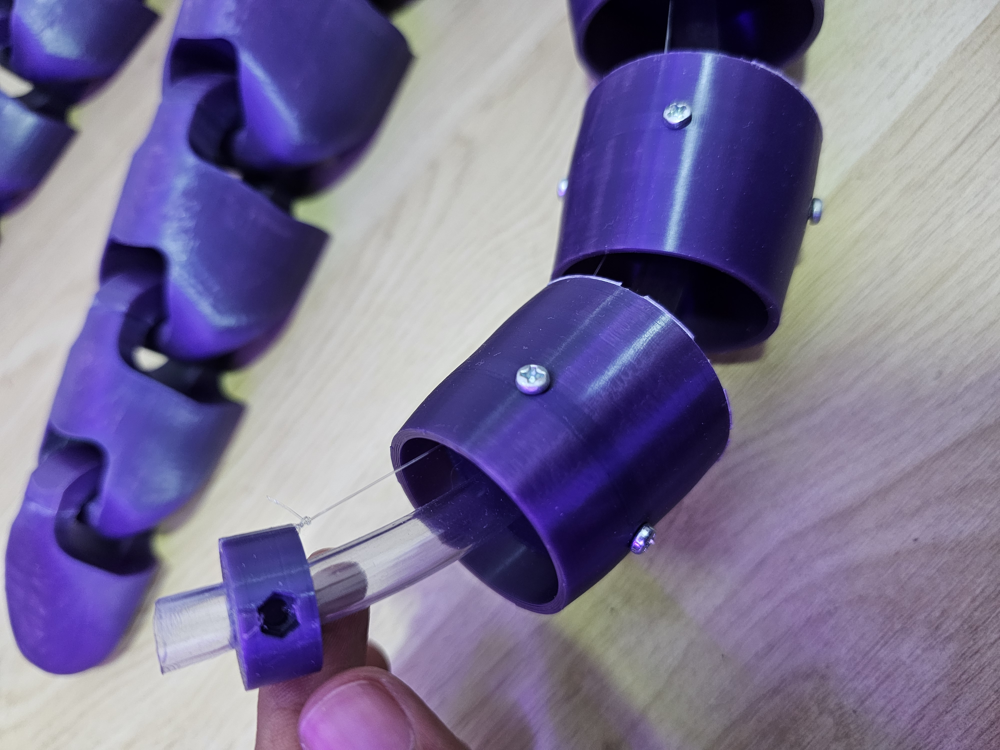
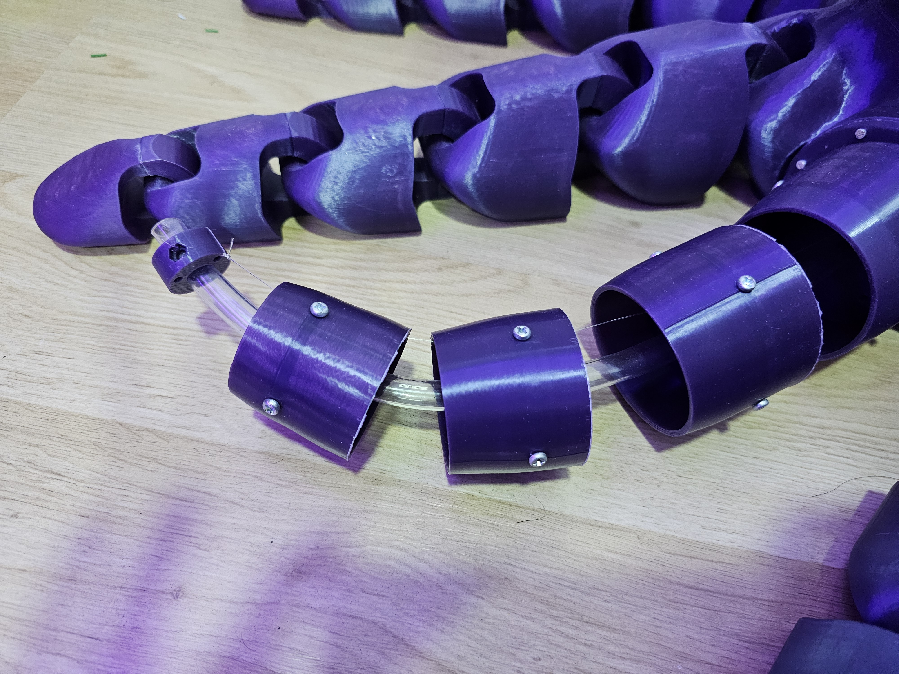
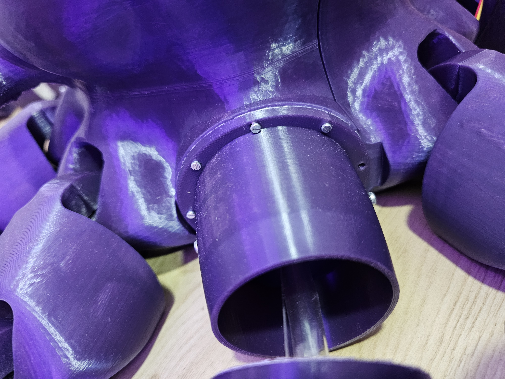
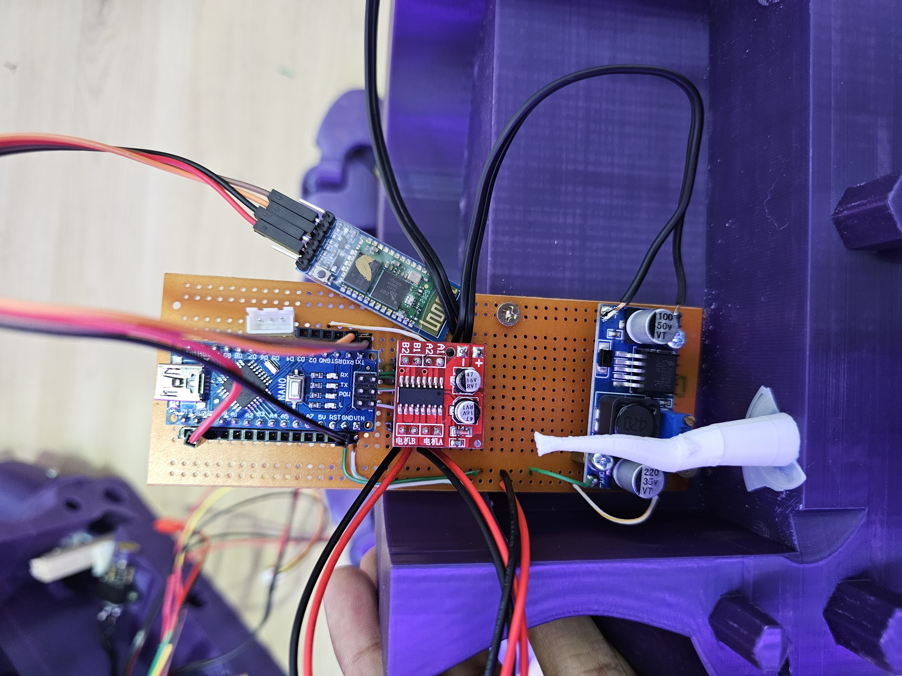
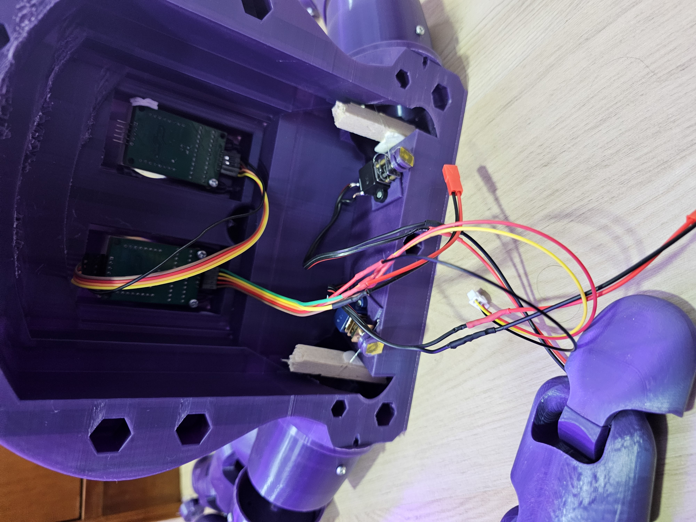
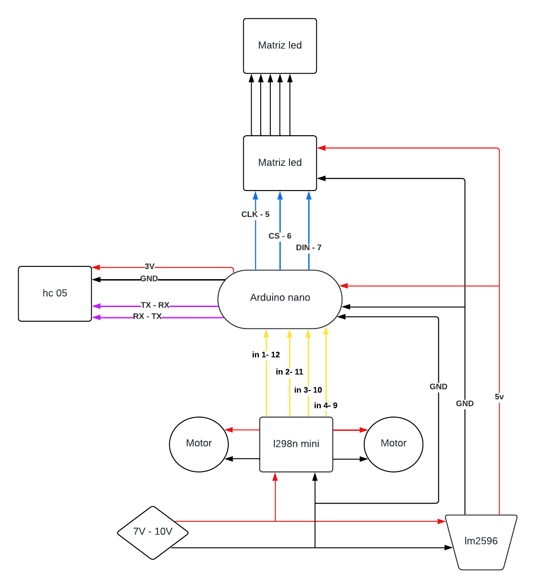

# Proyecto Pulpo Animatrónico

## Descripción del Proyecto

Este proyecto consiste en la creación de un animatrónico con forma de pulpo, desarrollado para el grupo ASME de la Universidad de La Sabana. El objetivo de este proyecto es demostrar las habilidades y conocimientos adquiridos en modelado 3D, electrónica, manufactura aditiva y programación, aplicados en la construcción de un dispositivo interactivo, en este caso, la mascota del programa de Ingeniería Mecánica. Este proyecto no solo busca destacar la competencia técnica de los estudiantes, sino también promover la creatividad y el trabajo en equipo.

## Contenidos

- [Modelo 3D](#modelo-3d)
- [Ensamble](#ensamble)
- [Electrónica](#electrónica)
- [APP](#APP)
- [Detalles del Proyecto](#detalles-del-proyecto)
- [Funciones](#funciones)
- [Reconocimientos](#reconocimientos)

## Modelo 3D

El modelo 3D base para el animatrónico fue obtenido de Maker World y posteriormente reescalado y modificado utilizando Fusion 360, un software avanzado de diseño y modelado 3D. El diseño incluye piezas móviles que permiten simular el movimiento natural de un pulpo, con dos brazos mecánicos que añaden dinamismo y realismo al modelo. Cada componente fue meticulosamente diseñado para asegurar su funcionalidad y durabilidad, teniendo en cuenta las limitaciones de la manufactura aditiva y la integración con los componentes electrónicos.

### Imágenes del Modelo 3D

*Vista isometrica del modelo 3D del animatrónico pulpo.*

## Ensamble

### Cuerpo

Para ensamblar el cuerpo del animatronico se usaron encajes, esto permite ensamblar y desensamblar con el objetivo de tener un acceso completo a la electronica del sistema

  

*Ensamble cuerpo*

### Tentaculo Mecanico

Para lograr un movimiento mecanico de los tentaculos empleamos un sistema de 2 partes:

Esqueleto: Esta parte consta de una manguera de 9mm la cual permite que el tentaculo recupere su forma original, y pegado a este van varios discos cuya funcion principal es guiar un hilo de nilon que esta amarrado tanto al disco externo como a un motor, permitiendo asi la movilidad del tentaculo, ademas de esto los discos cuentan con agujeros para poner tuercas (para esto se calentaron para deformar el PLA y ademas se aplico pegante instantaneo), las cuales permiten unir el esqueleto con la carcasa.

*Esqueleto y manguera.*

*Union esqueleto-carcasa.*

Carcasa: Esta parte es basicamente estetica y esta unida a los discos gracias a tornilleria.

*Carcasa casi completa.*

*Union tentaculo-cuerpo.*

## Electrónica

Para asegurar un funcionamiento óptimo y facilidad de ensamble y desensamble o reparacion se implementaron variedad de componentes electronicos en una baquela, uniendo todos los componentes dentro de esta y enlazando con los componentes externos con conectores jst. Los componentes principales incluyen un microcontrolador Arduino Nano, un módulo Bluetooth para la comunicación inalámbrica, matrices LED para las expresiones faciales, y motores controlados por un puente H para los movimientos mecánicos. A continuación se detallan los principales componentes y su función en el proyecto:

- **Microcontrolador**: Utilizamos un Arduino Nano, seleccionado por su tamaño compacto y capacidad para manejar múltiples entradas y salidas, lo cual es esencial para el control preciso de los movimientos y las acciones del pulpo.
- **Motores y actuadores**: Implementamos dos mini motoreductores para permitir el movimiento fluido de los brazos mecánicos, y dos matrices LED para crear expresiones faciales dinámicas y atractivas.
- **Sensores y módulos adicionales**: Incorporamos un módulo Bluetooth para permitir el control remoto del animatrónico a través de una aplicación móvil, facilitando la interacción del usuario con el dispositivo.

*Baquela con la electronica.*

*Componentes externos.*

### Plano Electrico

*Plano electrico del animatrónico pulpo.*

## APP

### Versión Inicial: App "PULPI" con App Inventor

Para el control del prototipo del pulpo animatrónico, se desarrolló inicialmente una aplicación móvil denominada **"PULPI"** utilizando la plataforma **App Inventor**. Esta herramienta permitió una creación rápida y sencilla de la interfaz de usuario y la lógica básica necesaria para el control del animatrónico. 

#### Funcionamiento de la Aplicación

_(Descripción del funcionamiento de la aplicación con App Inventor: incluir aquí detalles sobre la interfaz, los controles disponibles y cómo se interactúa con el pulpo animatrónico)_

### Versión 2.0: Migración a Android Studio

Con el objetivo de mejorar la funcionalidad, el rendimiento y la personalización de la aplicación, se desarrolló la versión 2.0 **"Octopus app"** utilizando **Android Studio**. Esta nueva versión permite integrar características más avanzadas, optimizar la experiencia del usuario y proporcionar una interfaz más moderna y funcional, esto no lo explotamos en su maximo sin embargo en la seccion app se encuentra tanto el apk como el proyecto comprido para permitir su modificacion.

#### Funcionamiento de la Aplicación

## Detalles del Proyecto

El proyecto fue desarrollado para el grupo ASME y fue presentado durante la inauguración de la carrera de Ingeniería de Diseño e Innovación en la Universidad de La Sabana. Para lograrlo, se siguieron varias etapas cuidadosamente planificadas:

1. **Investigación y planificación**: Durante esta fase inicial, se revisó la viabilidad del proyecto. Se investigaron las mejores prácticas en diseño de animatrónicos y se elaboró un plan detallado que abarcaba desde la conceptualización hasta la implementación final.
2. **Diseño y modelado**: Esta fase fue crucial y una de las más largas del proyecto. Utilizamos Fusion 360 para crear un modelo 3D detallado y funcional del pulpo. Se realizaron múltiples iteraciones y verificaciones para asegurar que cada componente encajara perfectamente y funcionara según lo previsto.
3. **Construcción y ensamblaje**: Para la manufactura de las piezas, empleamos una impresora 3D Bambu Lab P1S, que nos permitió crear componentes precisos y duraderos. El ensamblaje se llevó a cabo con cuidado, asegurando que todos los componentes mecánicos y electrónicos estuvieran correctamente integrados.
4. **Programación y pruebas**: La programación del animatrónico fue desarrollada en Arduino, y se creó una aplicación móvil para permitir la interacción y control del dispositivo. Se realizaron pruebas exhaustivas para verificar el correcto funcionamiento de todas las funciones y asegurar la fiabilidad del animatrónico.

## Funciones

El animatrónico pulpo cuenta con varias funciones destacadas, diseñadas para mostrar su capacidad interactiva y atraer la atención del público. Entre las principales funciones se encuentran:

- **Movimiento electrónico de los brazos**: Dos de los brazos del pulpo son controlados electrónicamente, permitiendo movimientos fluidos y realistas que simulan el comportamiento natural de un pulpo.
- **Expresiones faciales dinámicas**: Utilizando matrices LED, el pulpo puede mostrar diversas expresiones faciales, añadiendo un nivel de interacción emocional con los espectadores.
- **Integración de etiquetas NFC**: Se incorporaron etiquetas NFC en tres de las puntas de los tentáculos, permitiendo la interacción con dispositivos compatibles y agregando una capa adicional de interactividad.
- **TO DO**: Aunque el proyecto no incluyó una función de voz debido a limitaciones de tiempo, se puede incorporar esta característica en el futuro para aumentar la interacción y realismo del animatrónico.

### Videos del Proyecto

  

*Video demostrativo del animatrónico pulpo en acción.*

## Reconocimientos

Este proyecto no hubiera sido posible sin el esfuerzo y la dedicación de los siguientes miembros del grupo ASME:

- Juan Sebastián Ulloa Mejía
- Juan David Hoyos Bernate
- María Juliana Amezquita Herrera
- Laura Alejandra Yepes Tobos

Agradecemos también a Rafael Enrique Álvarez Robles y Jorge Alberto Castellanos Rivillas por su guía y apoyo durante el desarrollo del proyecto. Su experiencia y conocimientos fueron fundamentales para el éxito de esta iniciativa.

---

¡Gracias por visitar nuestro proyecto! Si tienes alguna pregunta o comentario, no dudes en contactarnos.
